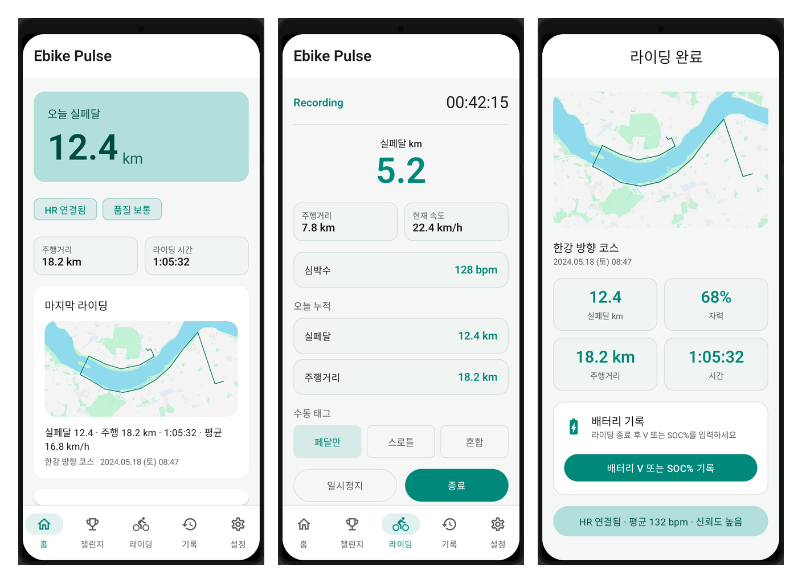

# Ebike Pulse - 실페달

전기자전거(e-bike) 라이딩에서 **실제로 페달을 밟아 운동한 거리(실페달 km)** 를 추정·기록하고, 운동량/칼로리/배터리 사용 패턴을 함께 트래킹하는 안드로이드 앱.

## 예상 UI (목업)

> [`implementation-design.md` §3](docs/implementation-design.md#3-uiux-구체안) · [`mockup-spec.md`](docs/images/mockups/mockup-spec.md) 기준 **Pixel 9:20(1080×2400) 설계 목업**입니다. `ui/mockup/` Compose 레이아웃을 Paparazzi로 렌더링했으며, [`scripts/compose_mockups.py`](scripts/compose_mockups.py)로 README용 PNG·overview를 만듭니다. 실제 앱 스크린샷이 아닙니다.

*왼쪽부터 홈 · 라이딩 중 · 종료 리포트*

## 핵심 아이디어

- **GPS + 심박(HR) + (선택) 수동 태그**로 주행 구간을 분석해 **자력 기여도(0~100%)** 를 추정
- 핵심 KPI는 **실페달 km** (자력 추정 비율을 반영한 “실제 페달한 거리” 환산값)
- 전기자전거 특성상 PAS/스로틀을 앱이 직접 읽기 어렵기 때문에, **100% 판별이 아니라 추정**으로 접근

## 결정된 제품 방향 (요약)

- **워치 1차 타깃**: Galaxy Watch (폰과 블루투스 동행)
- **오프라인**: 라이딩 핵심 기능은 인터넷 없이 동작
- **지도**: 라이딩 중 지도 없음(숫자 중심), **라이딩 종료 후** 궤적 지도 표시(B안)
- **수동 태그**: 안 눌러도 동작, 누르면 정확도 향상 (페달만 / 스로틀 / 혼합)
- **배터리 입력**: 정격 V + Ah/Wh 1회 등록, 종료 후 V 또는 SOC% 기록

## 문서

- 문서 지도: [`docs/index.md`](docs/index.md)
- 제품 스펙: [`docs/product-spec.md`](docs/product-spec.md)
- 구현·설계: [`docs/implementation-design.md`](docs/implementation-design.md)

## 개발 상태

- 프로젝트 생성 및 스펙 문서 정리 완료
- 구현은 다음 단계에서 진행

